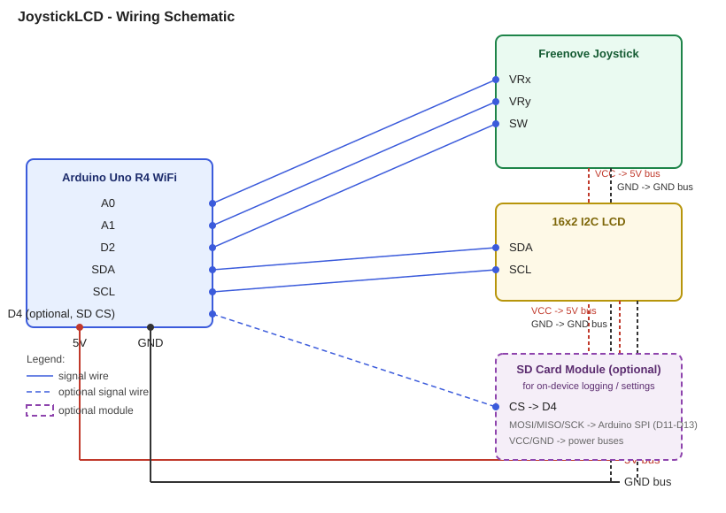

# JoystickLCD

A work-in-progress Arduino project for the **Uno R4 WiFi** that drives a 16x2 I2C LCD menu using a Freenove analog joystick module, with WiFi setup, a quick site-status checker, and the board's built-in LED matrix put to use.

## Hardware

- Arduino Uno R4 WiFi
- Freenove joystick module (analog X/Y + push button)
- 16x2 I2C LCD (LiquidCrystal_I2C, address `0x27`)
- Breadboard + jumper wires
- *(optional)* SD card module, for on-device settings/log persistence

## Schematic

## Wiring

| Joystick pin | Arduino pin |
|---|---|
| VRx | A0 |
| VRy | A1 |
| SW  | D2 |
| VCC | 5V |
| GND | GND |

LCD connects via I2C (SDA/SCL) plus 5V/GND.

*(Optional)* SD card module: CS -> D4, MOSI/MISO/SCK -> the R4's SPI pins (D11-D13), VCC/GND shared with the rest of the circuit. If no SD module is wired up, the sketch detects that at boot and just logs to Serial instead - nothing else changes.

## Features

- Joystick-driven main menu (UP/DOWN to navigate, PRESSED to select, LEFT to go back)
- **WiFi Setup** - scans nearby networks, browse with UP/DOWN, then type a password with the joystick (UP/DOWN cycles the character, RIGHT commits it and advances, LEFT backspaces) and connect
- **Site Check** - type a hostname the same way, and it reports back 200 OK / 404 Not Found / "Auth needed" (401/403) / no response - a quick way to sanity-check the WiFi connection actually reaches the internet
- **LED Matrix** - drives the Uno R4 WiFi's onboard 8x12 LED matrix; UP/DOWN cycles between four visualizations (Sparkle, Rain, Rings, Bounce)
- **Mouse Mode** - turns the joystick into a USB HID mouse (analog deflection moves the OS cursor, the button clicks). This is one-way: once active there's no joystick input left over to navigate back out with, so **reset the board or unplug it from power** to return to the menu
- **Settings** - toggle the LCD backlight (the only thing this I2C backpack exposes in software; contrast is a physical trim-pot), and re-probe for an SD card on demand (hot-swaps persistence over to it if one is found, no reboot needed)
- **About** - project/version info via the reusable scrolling-text helper
- Persistent settings and an on-device log file when an SD card module is present, via a swappable storage layer (falls back to Serial-only logging otherwise)
- Verbose Serial output (115200 baud) for debugging: screen transitions, joystick input, WiFi scan/connect results, HTTP checks

## Design

Menu screens share one small contract (`Screen.h`): `enter()`, `handleInput()`, `update()`. `ScreenManager` swaps between them, so adding a new screen doesn't touch the main sketch or any other screen. Joystick-driven text entry (used by both WiFi Setup and Site Check) is factored into `TextEntryScreen`, a reusable base class. Persistence goes through a `Storage` contract (`SdStorage` / `NullStorage`), so the rest of the code never has to ask "is there an SD card?".

## Status

Work in progress. Menu navigation, WiFi scan/connect, site status checks, the LED matrix visualizations, and backlight toggle all work. Known limitations: WPA2 passwords are entered one character at a time via joystick (slow, but functional); Mouse Mode compiles against the Uno R4 WiFi's native USB HID support but hasn't been confirmed on real hardware yet; the SD storage layer compiles cleanly but hasn't been tested against a physical card - use Settings -> SD Card to check whether one is detected.

## Debugging

Open the Serial Monitor at **115200 baud** to see screen transitions, joystick input, WiFi scan results, connection attempts, and HTTP status checks as they happen.

## Dependencies

Install via Arduino Library Manager (or `arduino-cli lib install`):

- [LiquidCrystal_I2C](https://github.com/johnrickman/LiquidCrystal_I2C)
- `SD` (Arduino's official SD library - only needed if you wire up an SD card module)

`WiFiS3` and `Arduino_LED_Matrix` ship with the Uno R4 board core, no separate install needed.

## License

MIT
